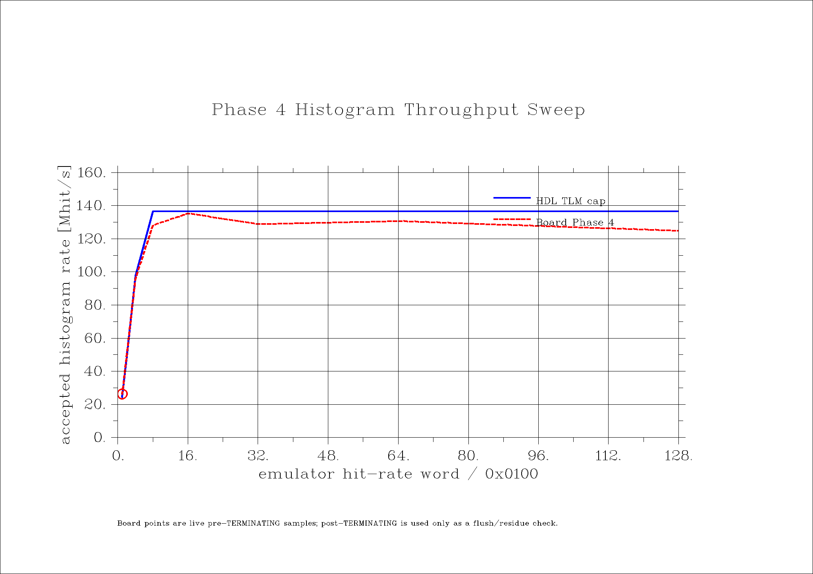

# Phase 4 Board Test Report

Date: 2026-04-25

This report summarizes the on-board Phase 4 emulator/histogram evidence and
links it to the TLM and RTL simulation artifacts.

## Board Evidence

Primary board report:
[`inputs/board/phase4_emulator_20260425_hist_fifo_depth_full_sweep_flushaware.md`](inputs/board/phase4_emulator_20260425_hist_fifo_depth_full_sweep_flushaware.md)

Stage-counter report:
[`inputs/board/phase4_stage_probe_20260425_hist_fifo_depth_rate0800_flushaware.md`](inputs/board/phase4_stage_probe_20260425_hist_fifo_depth_rate0800_flushaware.md)

Board setup from the report:

| Field | Value |
|---|---|
| timestamp | `2026-04-25T21:22:51` |
| SC link | 2 |
| FEB target | 7 |
| device | `/dev/mudaq0` |
| result | PASS |

## Primary 8-Lane Run

The primary 8-lane run used `hit_rate=0x0800`, post ingress, and a live
pre-TERMINATING sample with post-end flush checking.

| Quantity | Value |
|---|---:|
| sample spacing | 0.100 s |
| `TOTAL_HITS` delta | 13075621 |
| `DROPPED_HITS` delta | 0 |
| post-end FIFO/queue empty | yes |
| lane-go after reset release | `0x000001FF` |
| histogram ingress status | `0x00000403` |
| underflow / overflow | 0 / 0 |

All eight emulator lanes reported advancing frame counters and nonzero event
counts.

## Rate Sweep

The plotted board rate sweep is generated from
[`artifacts/phase4_rate_sweep.csv`](artifacts/phase4_rate_sweep.csv).

| Label | Hit rate | Board rate | Dropped | Result |
|---|---:|---:|---:|---|
| `r0100` | `0x0100` | 26.231170 Mhit/s | 0 | PASS |
| `r0200` | `0x0200` | 49.421830 Mhit/s | 0 | PASS |
| `r0400` | `0x0400` | 95.905450 Mhit/s | 0 | PASS |
| `r0800` | `0x0800` | 128.252260 Mhit/s | 0 | PASS |
| `r1000` | `0x1000` | 135.360020 Mhit/s | 0 | KNEE |
| `r2000` | `0x2000` | 128.986620 Mhit/s | 0 | CLIPPED |
| `r4000` | `0x4000` | 130.794350 Mhit/s | 0 | CLIPPED |
| `r8000` | `0x8000` | 124.972800 Mhit/s | 0 | CLIPPED |

The saturation knee is `0x1000` at 135.360020 Mhit/s. No point in the sweep
reported a `DROPPED_HITS` delta.

## Stage Counter Probe

The stage probe ran two `0x0800` iterations and both classified as PASS.

| Iteration | MTS hits | Ring push | Ring pop | Frame actual | Hist total | Hist drop | Flush |
|---:|---:|---:|---:|---:|---:|---:|---|
| 0 | 71519429 | 83441992 | 83441718 | 95010808 | 49247643 | 0 | clean |
| 1 | 70854857 | 82759510 | 82759059 | 94776715 | 49209095 | 0 | clean |

The probe confirms that the high-rate path was active beyond the terminal
histogram counter and that post-end residue was clean in both iterations.

## Simulation Cross-Checks

TLM and RTL simulation details are in
[`TLM_REPORT.md`](TLM_REPORT.md).

Key cross-checks:

| Check | Result |
|---|---|
| HDL/TLM Questa run | 0 errors, 0 warnings |
| RTL integration run | 4 passed, 0 failed |
| TLM cap | 136.718750 Mhit/s |
| Board knee | 135.360020 Mhit/s |
| Board knee vs TLM cap | 0.994 percent low |
| RTL latency max | 1589 cycles |
| TLM latency max | 1567 cycles |

## Open Items

SignalTap Phase 4.3 was not compiled into the nostp image used by the existing
board report, so no SignalTap no-fire window is claimed here.

The current emulator RTL uses `INJECT_MASK` for the masked-trigger conduit, not
for background Poisson traffic. The literal Phase 4.5 channel-mask sweep still
needs a masked-pulse source or equivalent driver before it can be closed from
host software.

## Verdict

Phase 4 emulator/histogram functional testing is PASS for the current scope:
8-lane emulator activity, histogram accumulation, zero dropped histogram hits,
flush-aware post-end residue checking, stage-counter activity, and a documented
throughput knee near the TLM acceptance cap.
