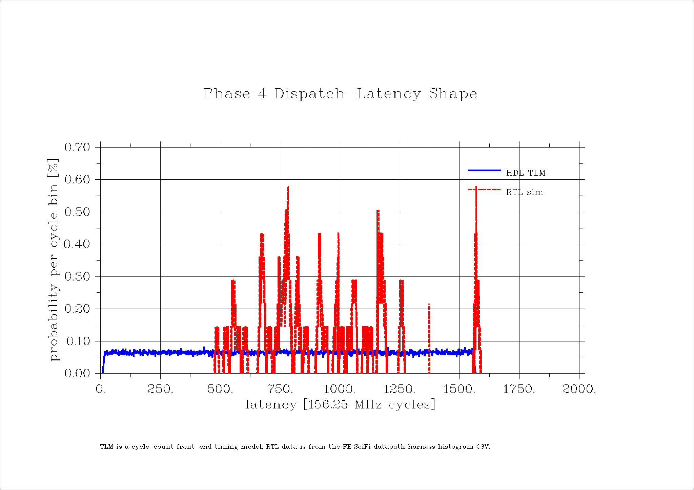

# Phase 4 TLM and RTL Simulation Report

Date: 2026-04-25

This report records the standalone HDL/TLM simulation and compares it with the
available RTL integration-simulation histogram evidence.

## Commands

Standalone HDL/TLM simulation:

```bash
bash quartus_system/board_test/phase4/scripts/run_phase4_tlm.sh
```

DISLIN artifact collection and plot rendering:

```bash
bash quartus_system/board_test/phase4/scripts/render_phase4_plots.sh
```

RTL datapath measurement command for refreshing the current evidence:

```bash
TB_DP_VSIM_ARGS='+TB_DP_PRE_RBCAM_MEAS +TB_DP_RUN_CYCLES=5000 +TB_DP_HIT_RATE=ffff +TB_DP_SHORT_MODE=1 +TB_DP_REPORT_DIR=/tmp/phase4_rtl_refresh' \
  bash quartus_system/tb_int/INT_fe_scifi_v3-2026-04-17/scripts/run_dp_e2e.sh
```

The report below uses the already reviewed
`ts_soak_exact5k_stable` output copied under
`quartus_system/board_test/phase4/inputs/` rather than overwriting the original
RTL harness report directory.

## HDL/TLM Result

Source:
[`tlm/phase4_latency_tlm.sv`](tlm/phase4_latency_tlm.sv)

Run log:
[`artifacts/phase4_tlm_run.log`](artifacts/phase4_tlm_run.log)

The HDL/TLM run used Questa Sim 2026.1_1 and completed with:

```text
PHASE4_TLM_DONE ... latency_total=249211
Errors: 0, Warnings: 0
```

Generated TLM artifacts:

| Artifact | Contents |
|---|---|
| [`artifacts/phase4_tlm_latency_hist.csv`](artifacts/phase4_tlm_latency_hist.csv) | latency histogram for `rate_word=0x0800` |
| [`artifacts/phase4_tlm_rate_sweep.csv`](artifacts/phase4_tlm_rate_sweep.csv) | generated/accepted/backlog rows for `0x0100..0x8000` |
| [`artifacts/phase4_tlm_summary.txt`](artifacts/phase4_tlm_summary.txt) | model parameters |

TLM latency summary:

| Metric | Cycles |
|---|---:|
| minimum | 8 |
| p50 | 786 |
| p90 | 1407 |
| p99 | 1547 |
| maximum | 1567 |

TLM rate summary:

| Rate word | Accepted rate |
|---:|---:|
| `0x0100` | 24.435938 Mhit/s |
| `0x0200` | 48.919531 Mhit/s |
| `0x0400` | 97.757031 Mhit/s |
| `0x0800` | 136.718750 Mhit/s |
| `0x1000` | 136.718750 Mhit/s |
| `0x2000` | 136.718750 Mhit/s |
| `0x4000` | 136.718750 Mhit/s |
| `0x8000` | 136.718750 Mhit/s |

The TLM backlog becomes nonzero at `0x0800` and above, which is the model's
indication that the generated stream has reached the acceptance cap.

## RTL Simulation Evidence

Source directory:
[`inputs/rtl_ts_soak_exact5k_stable/`](inputs/rtl_ts_soak_exact5k_stable/)

Relevant files:

| Artifact | Contents |
|---|---|
| [`inputs/rtl_ts_soak_exact5k_stable/run.log`](inputs/rtl_ts_soak_exact5k_stable/run.log) | RTL integration-simulation transcript |
| [`artifacts/phase4_rtl_latency_hist.csv`](artifacts/phase4_rtl_latency_hist.csv) | copied RTL latency histogram used for plotting |

The RTL run reports:

```text
Results: 4 PASSED, 0 FAILED
Errors: 0, Warnings: 34, Suppressed Warnings: 2
```

The warnings are uninitialized `mutrig_reset_controller_0` reconfiguration
read-data port bits in the simulation wrapper. They do not coincide with a
failing Phase 4 datapath assertion or histogram status.

RTL measured datapath counters:

| Quantity | Value |
|---|---:|
| accepted type1 words | 2432 |
| pre-RBCAM rate histogram total | 2432 |
| active rate bins | 256 |
| rate histogram dropped/under/over | 0 / 0 / 0 |
| latency histogram total | 1381 |
| latency histogram dropped/under/over | 0 / 0 / 0 |

RTL latency summary:

| Metric | Cycles |
|---|---:|
| minimum | 476 |
| p50 | 865 |
| p90 | 1252 |
| p99 | 1580 |
| maximum | 1589 |

## TLM vs RTL Plot



The TLM curve is a cycle-count reference for frame-bound waiting plus a small
pipeline term. The RTL curve is sparse and peaked because it records the
integration harness datapath dispatch bins. The useful comparison is the
support and scale: both remain inside the same short-frame cycle window, with
the RTL maximum at 1589 cycles and the TLM maximum at 1567 cycles.

## Plot Generation

The renderer is
[`scripts/phase4_dislin_plots.c`](scripts/phase4_dislin_plots.c). DISLIN
11.5.2 produced both PNG and SVG outputs with `Warnings: 0`:

- [`artifacts/phase4_dislin_png.log`](artifacts/phase4_dislin_png.log)
- [`artifacts/phase4_dislin_svg.log`](artifacts/phase4_dislin_svg.log)

The final PNGs were visually inspected after rendering; axes, legends, titles,
and captions are readable and not clipped.
